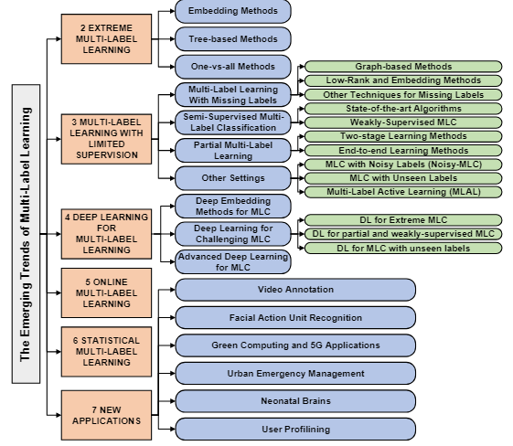

# 
Multi-label Research

## Category

1. 按文章目标（mainly based on *The Emerging Trends of Multi-Label Learning*）

- **综述类**

| Title                                       | Description                                                  | State              | Repository |
| ------------------------------------------- | ------------------------------------------------------------ | ------------------ | ---------- |
| A Review On Multi-Label Learning Algorithms | 周志华老师的，更多地关注于机器学习方法，8种常见模型          | :heavy_check_mark: | None       |
| The Emerging Trends of Multi-Label Learning | Anchor， | :heavy_check_mark: | None       |
|                                             |                                                              |                    |            |

- **XMLC(Extreme multi-label learning)**

  :star:   one vs all.    

  传统的就是针对每一个标签训练一个分类器，削弱了每个标签之间的关联性。

  可推荐阅读：

| Title                                                        | Description | State | Repository |
| ------------------------------------------------------------ | ----------- | ----- | ---------- |
| DiSMEC - Distributed Sparse Machines for Extreme Multi-label Classification |             | :x:   | None       |

​		:star:  Tree

| Title                                                        | Description | State | Repository |
| ------------------------------------------------------------ | ----------- | ----- | ---------- |
| Extreme F-measure maximization using sparse probability estimates |             | ❌     | None       |
| A no-regret generalization of hierarchical softmax to extreme multi-label classification |             | ❌     | None       |
| Fastxml: a fast, accurate and stable tree-classifier for extreme multi-label learning | classic     | ❌     | None       |

​		:star:  Embedding

|                                                        Title | Description                                                  | State              | Repository                               |
| -----------------------------------------------------------: | ------------------------------------------------------------ | ------------------ | ---------------------------------------- |
| Sparse local embeddings for extreme multi-label classification | SLEEC，经典方法！                                            | ❌                  | None                                     |
| Partial Multi-Label Learning by Low-Rank and Sparse Decomposition. |                                                              | ❌                  | None                                     |
| Query2Label: A Simple Transformer Way to Multi-Label Classification | Transformer的decoder学习label embedding，思路其实很简单，用一个Embedding层把它和backbone输出的channel数相match即可，backbone输出[2048,14,14]的feature map，2048是channel, 也是embedding，所以label的embedding大小也是2048。 | :heavy_check_mark: | https://github.com/SlongLiu/query2labels |

- **PML（Partial multi-label learning）**

|                                                       Title | Description | State | Repository |
| ----------------------------------------------------------: | ----------- | ----- | ---------- |
|                                Partial Multi-Label Learning | classic     | ❌     | None       |
|        Partial Multi-Label Learning with Label Distribution |             | ❌     | None       |
| Partial Multi-Label Learning via Credible Label Elicitation |             | ❌     | None       |
|                                                             |             |       |            |

- **SSMLC（semi-supervised MLC）**

- **MLML（Multi-label learning with missing label）**

|                                                        Title | Description                                                  | State              | Repository                                                   |
| -----------------------------------------------------------: | ------------------------------------------------------------ | ------------------ | ------------------------------------------------------------ |
|               Asymmetric Loss For Multi-Label Classification | classic，改loss function，提出ASL，对正负标签施加不同的focal weight | :heavy_check_mark: | [Alibaba-MIIL/ASL: Official Pytorch Implementation of: "Asymmetric Loss For Multi-Label Classification"(ICCV, 2021) paper (github.com)](https://github.com/Alibaba-MIIL/ASL) |
| Simple and Robust Loss Design for Multi-Label Learning with Missing Labels | 改loss function，加了Hill Loss, SPLC和focal margin           | :heavy_check_mark: | [xinyu1205/robust-loss-mlml (github.com)](https://github.com/xinyu1205/robust-loss-mlml) |
| Learning a Deep ConvNet for Multi-label Classification with Partial Labels |                                                              | ❌                  | None                                                         |

2. 按多标签分类中标签数量分类

- **single label**

|                                            Title | Description     | State              | Repository |
| -----------------------------------------------: | --------------- | ------------------ | ---------- |
| Multi-Label Learning from Single Positive Labels | 改loss function | :heavy_check_mark: |            |

3. 按文章的改进方向 

- **improve loss function**

(注：标*的代表上面已有相同的item)

|                                                        Title | Description                                                  | State              | Repository |
| -----------------------------------------------------------: | ------------------------------------------------------------ | ------------------ | ---------- |
|            *Multi-Label Learning from Single Positive Labels | 改loss function                                              | ✔️                  |            |
| *Simple and Robust Loss Design for Multi-Label Learning with Missing Labels | 改loss function，加了Hill Loss, SPLC和focal margin           | :heavy_check_mark: |            |
|              *Asymmetric Loss For Multi-Label Classification | classic，改loss function，提出ASL，对正负标签施加不同的focal weight | :heavy_check_mark: |            |
|                                                              |                                                              |                    |            |

- model label correlation

- change model structure