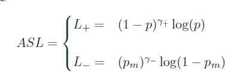

### *Asymmetric Loss For Multi-Label Classification*

1. **解决的问题**：多标签分类中，正负标签数量的不均衡问题
2. **解决方法**：对正负标签赋予不同的指数衰减因子。转移负样本的概率，直接丢弃一些容易呈现负的标签。在训练过程中动态调整不平衡等级。
3. **本篇文章的主要贡献**：

- 提出新的loss function: ASL，解决正负标签不均衡，以及错误标记问题
- 提出了控制不平衡等级的自适应过程，简化超参数选择
- 获得了sota结果
- 有代码，易用

4. **本文研究的问题是否已经提出过？**

是的，有提出过静态赋值正负标签对应参数的，但是不够灵活。

5. **文章中的实验是怎么做的？**

   其实是基于这张图做的消融实验：

   

   - 首先验证，不平衡因子$\gamma$的必要性
   - 然后验证将$\gamma$分解成$\gamma_+,\gamma_-$的有效性
   - 接着验证软阈值中margin m这个参数的重要性，结合$\gamma$
   - 验证$\gamma$ + margin的优势（有效性）
   - 最后验证adaptive方法的有效性！ 意思就是固定一个绝对的偏差，进行参数的调整

   

------

**论文中提及的一些细节：**

有人尝试使用更改loss function和重采样的方法解决这些问题，但loss function的方法只针对于**长尾问题**，而重采样方法不能改变某一特殊标签的分布。

问题：什么是**gamma**？ 惩罚参数还是什么？ gamma+ 和 gamma - 

就是一个参数，控制focus程度的

**BR方法（多个二元分类器联合）的损失函数**

1. 二元交叉熵

2. focal loss

$\gamma > 0$ 会惩罚那些不容易为正的标签，从而给正标签增加注意。

3. 本文提出的asymmetric loss

一般让$\gamma_{-} > \gamma_+$来强调正标签

概率转移（hard threshold），同时可以拒绝错误标记的标签，m是可调整的概率边界

4. ASL是多种损失trick的联合，优势是可以针对非常容易negative的标签，用硬阈值过滤掉，max；针对容易negative的标签，用soft (-m) 来削弱影响，并且能够拒绝误标签样本，保持梯度的连续。

------

**论文中的图像   证明哪些结论？**

减少$\gamma_+$ （增加了不平衡等级），提升了mAP

在二元交叉熵内，使用比较小的margin可以提升mAP，因为这个可以降低容易负样本的几率；而有$\gamma$的话，因为这个focal本身就能够达到降低负样本的效果，所以需要更高的margin进行控制。

