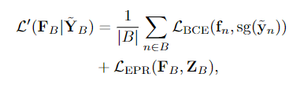

### *Multi-Label Learning from Single Positive Labels*


1. **为什么要做这个研究？**

- 研究这个设定可以减少数据集标注的花费
- 有一些数据集（如iNaturalist），虽然有很多类别，但是只有一类会被标注为真实类别
- 在这种最低监督成都下检测多标签分类器的性能

2. **本文的主要贡献**

- 在单个正确标签的设定下，检测多标签分类方法的表现
- 提出了一种新的针对单个正确标签的loss function
- 在4个多分类数据集上做loss的实验评估

3. **实验的基本设定**

关注的是partial observed的样本，最后出来的目标中只有一个是正标签，其他的都是unknowed的标志


对比三种多标签设置：partially observed（有观察到一部分正的，一部分负的，也有部分没观察到的）, fully observed, positive only label（所有观察到的标签都是正的，没有确定的负的，也就是说有一些是未确定？）

使用的损失函数是二元交叉熵

> **Q：为啥用二元交叉熵，概率求和不能等于1？**


4. **实验细节**

- weak negative


重点就是这个$\gamma$ ，本文采用$\gamma = \frac{1}{L-1}$，为了让single positive对loss起的作用与剩下的L-1个样本为负的作用是一样的。

- pseudo-negative 采样

意思就是说从L-1个样本中选一个出来，假设它就是负的，那么就会有下面的这个损失函数（ture negative会更容易出现）

$L_{IU}$


- label smoothing

减少训练多标签分类器中可以使用label smoothing, 减少过拟合


最后的loss：




就是先固定$Y_B$ 求 $F_B$ 和 先固定$F_B$ 求 $Y_B$ 的参数，然后综合一下。Loss_BCE保证图像分类与标签预测一致，Loss_EPR保证预测出来的正例以及正例个数是正确的

------

5. **为什么要这么设置loss函数？**

Loss_ROLE允许标签任意设置，只要和已知的标签、期望数量保持一致即可。这能够给予标签确定的信息，有确定信息的模型比无确定信息的模型训练效果更好。


6. **实验的结论**

- Loss_ROLE在线性例子中是一个很强的方法，能够接近Loss_IUN甚至超越（后者能够了解到更多标签）
- 单一标签训练，Loss_ROLE（允许任意标注，只要一致就行）的test MAP 与全标注的Loss_BCE具有可比性
- 单一正标签的loss函数很重要，false negative标签会对backbone的特征提取产生破坏，不能较好的应对标签noise
- label smoothing可以作为很好的baseline，比较robust
- 在训练端到端网络的时候，最好能将backbone先frozon几个epoch，会取得更好的效果


7. **未来工作**

- 对单一标签的标注有偏好问题，留给后人做，这篇文章只关注单一标签识别的潜力
- 在线估计，需要的内存大，希望后面能有矩阵分解的loss估计，或者更小的神经网络去逼近


```python
# 解冻模型的代码
if epoch ==1:
    for p in  Swin.backbone.parameters():
        p.requires_grad = True
        optimizer.add_param_group({'params': Swin.backbone.parameters()})

# 注意： 冻结模型的话，不仅要requires_grad = false，优化器也要用filter屏蔽
```


