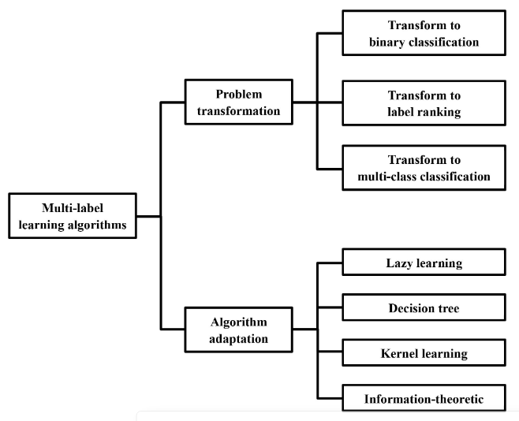
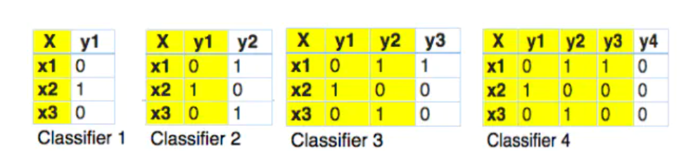

### *A Review on Multi-Label Learning Algorithms*

周志华老师的综述

1. **作者写作这篇文章的目的**

进行一个及时的回顾，以及对sota的**机器学习**算法进行强调。

2. **这篇文章中提到的前人的研究做的怎么样？偏向于哪些部分？**

- 早期研究多偏向于多标签**文本分类**
- 后来人们又倾向于研究自动标注、多媒体内容、信息生物学、web数据挖掘等等

3. **通过考虑标签相关性，算法可以大致分为下面几种**：

- 一阶段：仅考虑成对标签之间的互斥，把多分类问题拆解成多个独立的二分类问题。
  - 优点：简单，高效
  - 缺点：忽略了部分标签之间的相关性，得到的结果可能是次优的
- 二阶段：考虑成对标签的关系，用的是rank以及成对标签的交互（不是很明白）
- 高阶：在一个标签上添加所有标签的影响。会考虑一个更强的联系！

4. 算法分类

- 问题转化：将多标签问题转换为一阶、二阶或高阶的问题（固定算法，转换数据）
- 算法适应：采用流行的学习算法解决（固定数据，转换算法）




------

**文章细节**

1. 标签多样性量化程度指标：

- label cardinality  LCard(D)
- label density
- label diversity
- proportion of label sets


2. Binary Relevance的算法实现

```python
from skmultilearn.problem_transform import BinaryRelevance
from sklearn.svm import SVC

classifier = BinaryRelevance(
    classifier = SVC(),   # 对于每一个标签，都用SVM作为分类器，忽略了标签之间的相关性
    require_dense = [False, True]
)

# train
classifier.fit(X_train, y_train)

# predict
predictions = classifier.predict(X_test)
```

3. Classifier chain（分类器链）的算法实现

后面的分类器的分类依赖于前面的预测结果！（只对附近的那一个标签有效，而不是全局）



```python
from skmultilearn.problem_transform import ClassifierChain
from sklearn.naive_bayes import GaussianNB

classifier.fit(X_train, y_train)

predictions = classifier.predict(X_test)

accuracy_score(y_test,predictions)
```

4. Calibrated Label Ranking（标定的标签排序算法）

基本思想就是，构建成对标签的分类器（一共q(q-1)/2个），然后给一个人工的虚拟标签分割点，把测试数据放给这些分类器，得到其在各个类别标记上的投票，我们需要给每个标签确定一个阈值，标签投票结果大于阈值，那么才算这个标签有出现。

5. Adaptive algorithm

```python
from skmultilearn.adapt import MLkNN

classifier = MLkNN(k = 20)
classifier.fit(X_train, y_train)

pred = classifier.predict(X_test)
```


multi-label实战

[MultiLabel classification - YouTube](https://www.youtube.com/watch?v=NQLHAHYfu-I)

自然语言处理方面！

里面有多分类的accuracy和hamming loss的具体讲解与实现


产生多分类的数据集：

```python
from sklearn.datasets import make_multilabel_classification

X, y = make_multilabel_classification(sparse = Ture, n_labels = 20, return_indicator = 'sparse', allow_unlabeled = False)
# allow_unlabeled就是允许某些例子不属于任何一类
```

