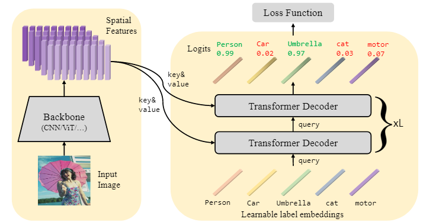

### *Query2Label: A Simple Transformer Way to Multi-Label Classification*

1. 本文为何做这个研究？motivetion是什么？

Transformer在cv中的高效表现、对于roi的更精确定位（采用transformer）、DETR中learnable label embedding的启发

2. 本文的主要贡献：
   - 提出了一个简单的Transformer-based的二阶段网络，主要是第二阶段，用label embedding与Transformer的decoder架构结合，判断类别标签的存在性
   - cross-attention模块可以自适应提取物体的feature, multi-head有用
   - 在MS-COCO, PASCAL VOC, NUSWIDE, Visuak Genome上做实验，取得良好效果

3. 主要的网络架构

图片解析：stage1负责学习image feature，作为transformer的key 和 value, stage2 中的label embedding 作为query（就和当时语音中的单词一样）。并且decoder层会将所有期望的特征汇集在一起，根据attention map。

------

**文中提到的细节**

1. 作者把多标签分类中作出的改进分为下面3类：

   - improving loss function
     - distribution-balanced loss
     - asymmetric loss
     - focal loss
   - Modeling label correlations
     - neural graph propagation learn category-correlated feature ( chen )
     - dynamic GCN ( Ye )
   - Locating regions of interest
     - 大多数使用了attention的方法去定位，但作者说这样还是会包含大量的背景信息

   