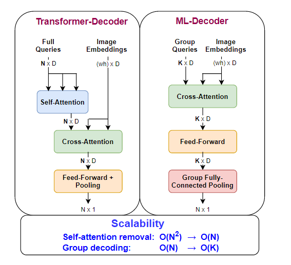

### *ML-Decoder: Scalable and Versatile Classification Head*

1. **文章写作的目的**

指出了GAP( global average pooling) head 和Attention-based head的不足（前者太简单了，无法对某些物体施加特别的关注，对所有类是一视同仁的，带来次优解；后者与类别数量的关系是二次的，会带来巨大的cost）。所以文章基于Transformer的decoder进行改进，提出了一种新的ML-decoder head. 

2. **文章的主要贡献**

- 提出的ML-Decoder适用于单标签、多标签和zero-shot的分类
- ML-Decoder可以作为GAP的替代，简单且便捷
- ML-Decoder可以针对类别个数进行放缩，特别是针对成千上万的类。对于unseen 的类别也能具有们好的泛化能力。
- 验证的数据集：Coco, Open Images, NUS-WIDE, VOC

3. **相对于Transformer的decoder, ML-Decoder有什么不同？**

- 删除了self-attention层，作者认为它是冗余的，因为这个projection layer可以转换输入的query成任何output. self-attention会增加计算的复杂度，cost和class成线性关系
- group- decoding: 为了去除classes和分类cost之间的耦合线性关系，设置了一个fixed number K，和类别个数是无关的。通俗来说，就是一维 MLP 出来的向量可以映射到多个logits，通过不同的projection layer. 
- 