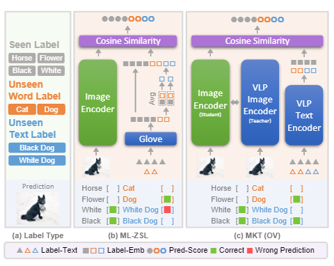
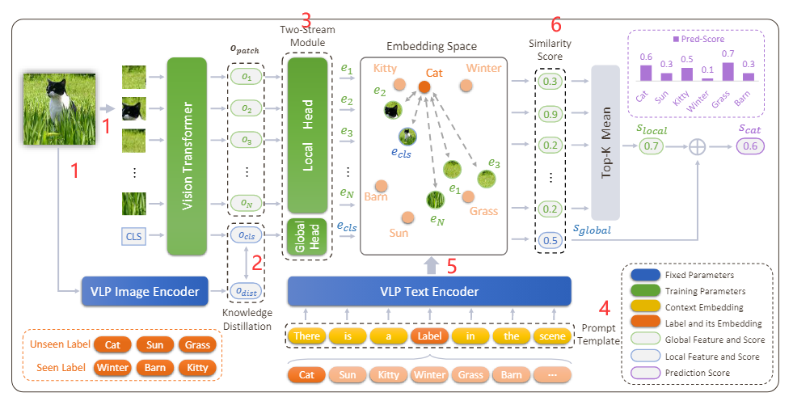
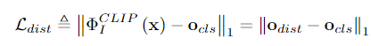
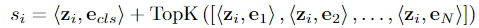
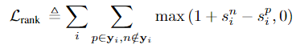
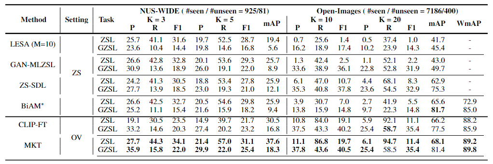

### *Open-Vocabulary Multi-Label Classification via Multi-modal Knowledge Transfer*

1. **文章提出的背景**

- 现在解决多标签zero-shot的预训练模型用的只是单模态（如语言），忽略了图像-文本对丰富的语义信息。
- 近期的open-vocabulary(OV) 在文本-图像对上取得了良好效果，但是没有被扩展到多标签zero-shot的领域中。

2. **文章主要想解决的主要问题以及相应的方法**

- 在multi-label zero-shot learning( ML-ZSL）中应用多模态，使得图像信息得到充分应用；将OV的方法拓展到ML-ZSL问题上。 

   -----------  多模态知识迁移（MKT），使用一个预训练好的vision and language pre-trained model（VLP），并且在训练的过程中，VLP的参数是不变的。

- 保证image和label的alignment，即图片与标签之间的对应关系（一致性）

   ----------- 在MKT框架中用知识蒸馏，保证一致性，label embedding使用prompt tuning。

3. **文章使用的框架以及框架解读**

**figure1:** 

**由下到上顺序**

图片经过一个Student Image Encoder（文中用的是ViT，可训练）以及一个预训练的VLP Image Encoder得出image embedding，然后在cls embedding上做知识蒸馏。

由VLP Text Encoder给出label embedding，由Student Image Encoder输出patch embedding，然后两个embedding做相似度计算。

**figure2:** 

**从左到右顺序：**

​		1 --- 图片分别输入ViT以及VLP Image Encoder，其中输入ViT的是non-overlapping patch，以及一个关于分类结果的embedding。经过transformer的encoder层后，得到下面的输出
$$
x_L = [o_{cls}, o_{patch}]
$$
​		2 --- 通过VLP得到的是老师模型的输出$o_{dist}$，然后用这个输出和$o_{cls}$进行距离计算（1范式），获得知识蒸馏部分的loss

​		3 --- $x_L$中的两个元素分别通过local head和global head（其实就是两个线性映射层），将维度映射为embedding space所需的维度

​		4 --- 在VLP Text Encoder前进行一部prompt tuning，因为不同的任务目标，如果仅仅使用VLP产生的label embedding，无法达到多分类的最优效果。

> prompt tuning: 将下游任务转换为pre-training的任务。先**制定**一个句子**模板**，比如说文中是" There is a [mask] in the scene"，mask部分填入的是标签词，后面需要做的是**标签词映射**，即给定哪些标签词是positive的，哪些是negative的。引入模板和标签词本质可理解为一种数据增强，通过增加提示的方式引入先验知识。

​		5 -- prompt tuning后的句子通过VLP text encoder映射到embedding space，产生label embedding $z$

​		6 -- similarity score的计算

​		7 -- 整个framework ranking loss的计算， $y_i$为ground truth

4. **实验设定**

- 数据集： NUS-WIDE , Open-Images
- 任务：zero-shot learning, generalized zero-shot learning（前者测试集全为没见过的，后者测试集既有见过的，也有没见过的）
-  sota模型：LESA, GAN-MLZSL, ZS-SDL, **BiAM**, CLIP-FT, **MKT**

5. **Ablation Study**

- 探究了distill 和 prompt tuning 各自起到的作用和组合起到的作用
- label embedding 中对比了GloVe（single modal）以及CLIP(multi modal)
- two stream module的作用，local head在F1上表现好，global head在mAP上表现好
- 关于知识蒸馏参数$k$和$\lambda$的研究
- 不同的backbone- VGG19 & ResNet50
- 标准的多分类任务（没有zero-shot）比较
- 与BiAM的Attention map比较